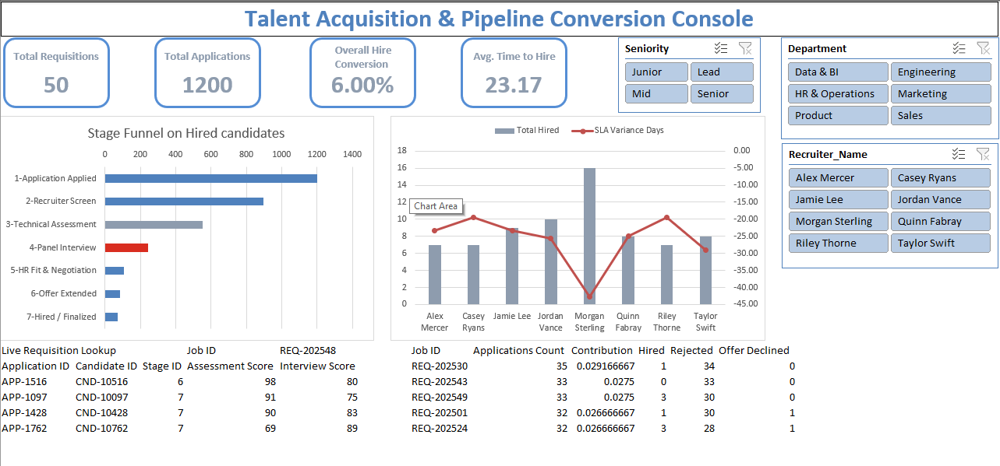

# 🎯 HR Recruitment Pipeline & Conversion Architecture

An enterprise-grade business intelligence application engineered natively inside Microsoft Excel. This project transforms raw, disconnected human resources data into a live analytical engine. By abandoning static spreadsheets and fragile `VLOOKUP` chains, this tool allows executives to instantly identify pipeline bottlenecks, track recruiter SLA performance, and monitor active candidate statuses in real-time without disrupting the underlying data structure.

---

## 📸 Executive Dashboard Console

---

## 📊 Executive Overview & Key Findings
Across the global **1,200-candidate pipeline**, the organization maintains a **6.00% Overall Hire Conversion** with an **Average Time to Hire of 23.17 Days**. However, interactive DAX slicing reveals critical variances in departmental efficiency and recruiter velocity:

* 🚨 **The Stage 4 Bottleneck:** Global pipeline analysis isolates **Stage 4 (Panel Interview)** as the most severe friction point. Pre-attentive conditional formatting visually highlights this massive drop-off rate for immediate executive intervention.
* ⚡ **Recruiter Velocity Discrepancies:** While the global average SLA variance shows recruiters beating targets by ~28 days, filtering reveals massive operational gaps. **Morgan Sterling** averages a staggering **-42.81 day variance** (a highly efficient closer), whereas peers pace significantly slower against the same SLA budgets.
* 🎯 **Top-Heavy Requisitions:** A custom dynamic array matrix isolates high-volume requisitions, flagging specific active pipelines as major resource drains requiring hyper-focused attention.

📄 **Read the full operational brief:** [Executive Summary & Action Plan](docs/executive_summary_report.md)

---

## ⚙️ Technical Architecture Highlights
The true value of this project lies in the hidden backend architecture. This tool operates on a **Hybrid Star Schema** loaded into Excel's xVelocity memory engine, connecting standard tables via explicit relational logic.

1. **Procedural Dataset Generation (Python):** To simulate the complexities of an enterprise hiring environment without violating data governance and PII security, the underlying dataset was procedurally engineered from scratch. A custom Python script utilizing `pandas` and randomized distribution logic was built to generate a highly realistic, 1,200-row relational database.
2. **Relational Mapping:** All raw data was converted into strict tables (`Dim_Jobs`, `Dim_Candidates`, `Dim_Stages`, `Dim_Recruiters`, `Fact_Applications`, `Fact_Stage_Movements`). 1-to-Many relationships flow unidirectionally from the Dimension tables to the Fact tables, with ambiguous paths evaluated to prevent circular dependency loops.
3. **Advanced DAX Engineering (The MVPs):** Standard PivotTable math was insufficient for the relational ratios required. 
    * **Filter Context Overrides (`ALL`):** Utilized to break out of strict PivotTable row filters, allowing the engine to calculate step-by-step Funnel Conversion Rates by looking back at previous stage volumes.
    * **Row-by-Row Iteration (`AVERAGEX` & `RELATED`):** Engineered to prevent SLA targets from defaulting to a global maximum. This forces the engine to travel up the relationship line, grab the specific target SLA for each hired candidate's distinct job, calculate the individual variance, and average the result.

📄 **Read the full engineering blueprint:** [Technical Usage & Architecture Guide](docs/technical_architecture_guide.md)

---

## 🖥️ UI & Interface Engineering
The user-facing layer, the **Talent Acquisition & Pipeline Conversion Console**, is designed with clean, software-like UI principles, stripping away native gridlines and utilizing pre-attentive color theory.

* 🛡️ **Shadow Anchor Architecture:** Macro KPI Shadow Cards (Total Requisitions, Applications, Conversion, Time to Hire) are decoupled from raw data. They read exclusively from a hidden `Staging_Pivots` layer driven by master Report Connections, ensuring they never break during aggressive filtering.
* 📉 **100% Stacked Funnel Chart & SLA Combo Chart:** Visually isolates stage-over-stage candidate drop-off in Crimson Red, while simultaneously evaluating total hires against SLA variance speed.
* 🔍 **Live Requisition Lookup:** A composite dynamic array utilizing nested `SORT`, `FILTER`, and `CHOOSECOLS` functions to generate a live, self-expanding grid of active candidates and their assessment scores for any selected Job ID.

---

## 🧠 Analytical Integrity & Methodology
This architecture was built on a foundation of independent problem-solving and rigorous structural testing.

* 🔬 **Diagnostic Engineering:** Complex array behaviors (such as Boolean logic inversions and filter context collisions) were intentionally stress-tested to map the boundaries of the calculation engine.
* 🤖 **Governed AI Synergy:** Large Language Models were utilized strictly as a senior technical sounding board—consulted for advanced DAX theory, syntax debugging, and theoretical best practices. No proprietary code, PII, or raw datasets were uploaded.
* 🏗️ **Execution:** The data modeling, UI design, dimensional mapping, and final nested dynamic arrays (including defensive `IFERROR` hierarchies) were written and executed by hand, ensuring complete mechanical ownership of the final product rather than relying on pre-built templates.

---

## 🚀 How to Run & Audit Locally
1. Clone or download this repository to your local machine.
2. Open **`HR_Recruitment_Data_Architecture.xlsx`** in Microsoft Excel (Office 365 recommended for Dynamic Arrays).
3. If prompted by Excel's security banner, click **Enable Content** / **Enable Data Connections** to activate the Power Pivot xVelocity engine.
4. Navigate to the **`Visual_Story`** tab to interact with the executive cockpit. 
5. **Stress-Test the Array:** Use the Slicers to filter for departments, then select an active Job ID from the **Live Requisition Lookup** dropdown in the bottom left to watch the custom dynamic array instantly spawn a ranked list of active candidates!    
